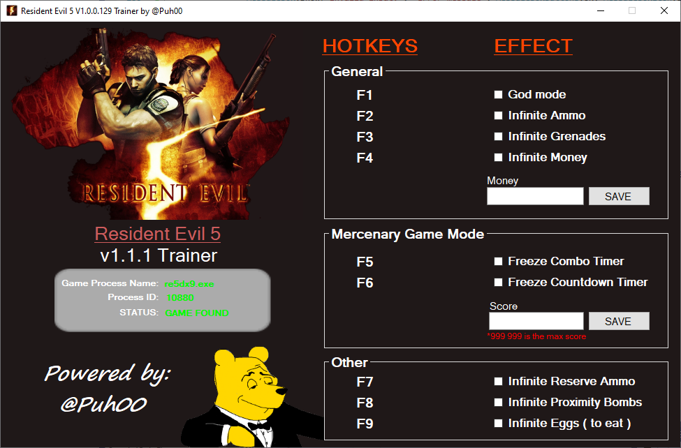

# Resident-Evil-5-Trainer

A game trainer for Resident Evil 5: Gold Edition which allows players to use cheats such as god mode. A copy of the game, on Steam (PC), is required to use this tool.

## Screenshots:

## Installation:
Please be aware that this trainer will not work if you used [Maluc's patch](http://www.sb-online.org/maluc/index.php?did=bh5fixes) for the "Games for Windows Live" (GFWL) problem that may occur when launching the game. Instead, use this alternative solution of simply inserting this [xlive.dll file](https://www.dropbox.com/s/9q0ui6miryroo0v/RE5%20Gold%20-%20XLive.7z?dl=0) into the folder where the executable lies (usually this path: \SteamLibrary\steamapps\common\Resident Evil 5\). 

The xlive.dll file will act as the GFWL, and thus bypass the installation of GFWL (which has a tendency of failing). 

For further information, check this [issue](https://github.com/Puh00/Resident-Evil-5-Trainer/issues/1).
### Download:
* [Latest Version](https://github.com/Puh00/Resident-Evil-5-Trainer/releases/tag/v1.1.2)
* [Older versions](https://github.com/Puh00/Resident-Evil-5-Trainer/releases)

## Other:
The game trainer was made with the help of [Cheat Engine](https://github.com/cheat-engine/cheat-engine) and *newagesoldier's* library, [memory.dll](https://newagesoldier.com/memory.dll/).
